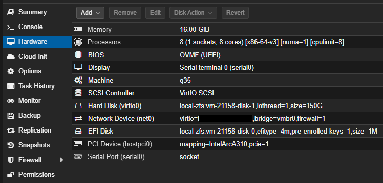

# ffvqe (FFmpeg video quality evaluations)

[](https://codecov.io/gh/naa0yama/ffvqe)


Video encoding quality evaluation project using VMAF and SSIM

FFmpeg を利用して ソフトウェア、 Intel QSV エンコーダーで動画をエンコードし SSIM, VMAF min/mean など映像品質の指標になるデータを計算し、 CSV と JSON で出力します。\
また、 yaml ファイルで outfile option を定義できるためパラメーターを複数試す時に楽ができ、グラフとして確認することも可能です。

## 環境及び実際の数値

[bast-parameter-hunting.md](docs/bast-parameter-hunting/bast-parameter-hunting.md) に記載しています。

抜粋すると、地上波放送で手軽にそれなりの圧縮率で、保存する場合は codec ごとに下記のパラメーターが有用

|                 |  File size |   bitrate | encode time | compress_rate | MSSIM |   VMAF min/mean | GOP   | bf  | refs | I/P/B frames             |
| :-------------- | ---------: | --------: | ----------: | ------------: | ----: | --------------: | :---- | :-- | :--- | :----------------------- |
| libx264 CRF     | 56,135.262 | 3,741.727 |      32.682 |         0.710 | 0.997 | 87.255 / 95.318 | 250.0 | 3.0 | 4.0  | 26.0 / 1,015.0 / 2,639.0 |
| libx265 CRF     | 50,252.294 | 3,349.594 |     102.439 |         0.741 | 0.997 | 86.860 / 95.175 | 250.0 | 3.0 | 1.0  | 21.0 / 916.0 / 2,727.0   |
| libsvtav1 CRF   | 32,370.096 | 2,157.646 |      59.117 |         0.822 | 0.997 | 79.178 / 94.927 | 161.0 | 0.0 | 1.0  | 23.0 / 3,574.0 / 0.0     |
|                 |            |           |             |               |       |                 |       |     |      |                          |
| h264_qsv LA_ICQ | 41,406.853 | 2,759.996 |       9.276 |         0.772 | 0.996 | 78.231 / 93.923 | 256.0 | 5.0 | 8.0  | 15.0 / 225.0 / 3,357.0   |
| hevc_qsv ICQ    | 38,546.974 | 2,569.370 |      30.499 |         0.787 | 0.997 | 78.858 / 94.378 | 248.0 | 5.0 | 1.0  | 15.0 / 0.0 / 3,582.0     |
| av1_qsv ICQ     | 43,167.632 | 2,877.362 |      32.293 |         0.761 | 0.997 | 80.600 / 94.959 | 248.0 | 0.0 | 1.0  | 15.0 / 3,582.0 / 0.0     |

### libx264

```bash
## プログレッシブ映像の場合
ffmpeg -y -threads 4  -hide_banner -ignore_unknown -fflags +discardcorrupt+genpts -analyzeduration 30M -probesize 100M \
  -map 0:v -c:v mpeg2video -i base.mkv \
  -c:v libx264 -preset:v medium -crf 23 \
  -color_primaries bt709 -color_trc bt709 -colorspace bt709 -color_range tv -max_muxing_queue_size 4000 \
  -movflags faststart -f mkv \
  \
  -map 0:a -c:a libopus -b:a 128k -ar 48k -ac 2 \
  out.mkv

## インターレースを解除する場合
ffmpeg -y -threads 4  -hide_banner -ignore_unknown -fflags +discardcorrupt+genpts -analyzeduration 30M -probesize 100M \
  -map 0:v -c:v mpeg2video -i base.mkv \
  -c:v libx264 -preset:v medium -crf 23 \
  -vf yadif=mode=send_frame:parity=auto:deint=all \
  -color_primaries bt709 -color_trc bt709 -colorspace bt709 -color_range tv -max_muxing_queue_size 4000 \
  -movflags faststart -f mkv \
  \
  -map 0:a -c:a libopus -b:a 128k -ar 48k -ac 2 \
  out.mkv
```

### libx265

```bash
## プログレッシブ映像の場合
ffmpeg -y -threads 4  -hide_banner -ignore_unknown -fflags +discardcorrupt+genpts -analyzeduration 30M -probesize 100M \
  -map 0:v -c:v mpeg2video -i base.mkv \
  -c:v libx265 -preset:v medium -crf 23 -tag:v hvc1 \
  -color_primaries bt709 -color_trc bt709 -colorspace bt709 -color_range tv -max_muxing_queue_size 4000 \
  -movflags faststart -f mkv \
  \
  -map 0:a -c:a libopus -b:a 128k -ar 48k -ac 2 \
  out.mkv

## インターレースを解除する場合
ffmpeg -y -threads 4  -hide_banner -ignore_unknown -fflags +discardcorrupt+genpts -analyzeduration 30M -probesize 100M \
  -map 0:v -c:v mpeg2video -i base.mkv \
  -c:v libx265 -preset:v medium -crf 23 -tag:v hvc1 \
  -vf yadif=mode=send_frame:parity=auto:deint=all \
  -color_primaries bt709 -color_trc bt709 -colorspace bt709 -color_range tv -max_muxing_queue_size 4000 \
  -movflags faststart -f mkv \
  \
  -map 0:a -c:a libopus -b:a 128k -ar 48k -ac 2 \
  out.mkv
```

### libsvtav1

```bash
## プログレッシブ映像の場合
ffmpeg -y -threads 4 -hide_banner -ignore_unknown -fflags +discardcorrupt+genpts -analyzeduration 30M -probesize 100M \
  -map 0:v -c:v mpeg2video -i base.mkv \
  -c:v libsvtav1 -preset:v 6 -crf 31 \
  -color_primaries bt709 -color_trc bt709 -colorspace bt709 -color_range tv -max_muxing_queue_size 4000 \
  -movflags faststart -f mkv \
  \
  -map 0:a -c:a libopus -b:a 128k -ar 48k -ac 2 \
  out.mkv

## インターレースを解除する場合
ffmpeg -y -threads 4 -hide_banner -ignore_unknown -fflags +discardcorrupt+genpts -analyzeduration 30M -probesize 100M \
  -map 0:v -c:v mpeg2video -i base.mkv \
  -c:v libsvtav1 -preset:v 6 -crf 31 \
  -vf yadif=mode=send_frame:parity=auto:deint=all \
  -color_primaries bt709 -color_trc bt709 -colorspace bt709 -color_range tv -max_muxing_queue_size 4000 \
  -movflags faststart -f mkv \
  \
  -map 0:a -c:a libopus -b:a 128k -ar 48k -ac 2 \
  out.mkv
```

### h264_qsv

```bash
## プログレッシブ映像の場合
ffmpeg -y -threads 4 -hide_banner -ignore_unknown -fflags +discardcorrupt+genpts -analyzeduration 30M -probesize 100M \
  -hwaccel_output_format qsv -hwaccel qsv -c:v mpeg2_qsv -i base.mkv \
  -c:v h264_qsv -preset:v veryslow -global_quality 25 -look_ahead 1 -bf 15 -refs 8 \
  -color_primaries bt709 -color_trc bt709 -colorspace bt709 -color_range tv -max_muxing_queue_size 4000 \
  -movflags faststart -f mkv \
  \
  -map 0:a -c:a libopus -b:a 128k -ar 48k -ac 2 \
  out.mkv

## インターレースを解除する場合
ffmpeg -y -threads 4 -hide_banner -ignore_unknown -fflags +discardcorrupt+genpts -analyzeduration 30M -probesize 100M \
  -hwaccel_output_format qsv -hwaccel qsv -c:v mpeg2_qsv -i base.mkv \
  -c:v h264_qsv -preset:v veryslow -global_quality 25 -look_ahead 1 -bf 15 -refs 8 \
  -vf vpp_qsv=deinterlace=advanced,setfield=mode=prog \
  -color_primaries bt709 -color_trc bt709 -colorspace bt709 -color_range tv -max_muxing_queue_size 4000 \
  -movflags faststart -f mkv \
  \
  -map 0:a -c:a libopus -b:a 128k -ar 48k -ac 2 \
  out.mkv
```

### hevc_qsv

```bash
## プログレッシブ映像の場合
ffmpeg -y -threads 4 -hide_banner -ignore_unknown -fflags +discardcorrupt+genpts -analyzeduration 30M -probesize 100M \
  -hwaccel_output_format qsv -hwaccel qsv -c:v mpeg2_qsv -i base.mkv \
  -c:v hevc_qsv -preset:v veryslow -global_quality 21 -bf 15 -refs 8  -tag:v hvc1 \
  -vf vpp_qsv=format=p010le \
  -color_primaries bt709 -color_trc bt709 -colorspace bt709 -color_range tv -max_muxing_queue_size 4000 \
  -movflags faststart -f mkv \
  \
  -map 0:a -c:a libopus -b:a 128k -ar 48k -ac 2 \
  out.mkv

## インターレースを解除する場合
ffmpeg -y -threads 4 -hide_banner -ignore_unknown -fflags +discardcorrupt+genpts -analyzeduration 30M -probesize 100M \
  -hwaccel_output_format qsv -hwaccel qsv -c:v mpeg2_qsv -i base.mkv \
  -c:v hevc_qsv -preset:v veryslow -global_quality 21 -bf 15 -refs 8  -tag:v hvc1 \
  -vf vpp_qsv=deinterlace=advanced,format=p010le,setfield=mode=prog \
  -color_primaries bt709 -color_trc bt709 -colorspace bt709 -color_range tv -max_muxing_queue_size 4000 \
  -movflags faststart -f mkv \
  \
  -map 0:a -c:a libopus -b:a 128k -ar 48k -ac 2 \
  out.mkv
```

### av1_qsv

```bash
## プログレッシブ映像の場合
ffmpeg -y -threads 4 -hide_banner -ignore_unknown -fflags +discardcorrupt+genpts -analyzeduration 30M -probesize 100M \
  -hwaccel_output_format qsv -hwaccel qsv -c:v mpeg2_qsv -i base.mkv \
  -c:v av1_qsv -preset:v veryslow -global_quality 24 \
  -vf vpp_qsv=format=p010le \
  -color_primaries bt709 -color_trc bt709 -colorspace bt709 -color_range tv -max_muxing_queue_size 4000 \
  -movflags faststart -f mkv \
  \
  -map 0:a -c:a libopus -b:a 128k -ar 48k -ac 2 \
  out.mkv

## インターレースを解除する場合
ffmpeg -y -threads 4 -hide_banner -ignore_unknown -fflags +discardcorrupt+genpts -analyzeduration 30M -probesize 100M \
  -hwaccel_output_format qsv -hwaccel qsv -c:v mpeg2_qsv -i base.mkv \
  -c:v av1_qsv -preset:v veryslow -global_quality 24 \
  -vf vpp_qsv=deinterlace=advanced,format=p010le,setfield=mode=prog \
  -color_primaries bt709 -color_trc bt709 -colorspace bt709 -color_range tv -max_muxing_queue_size 4000 \
  -movflags faststart -f mkv \
  \
  -map 0:a -c:a libopus -b:a 128k -ar 48k -ac 2 \
  out.mkv
```

## テスト環境

Proxmox VE 上に Ubuntu 24.04 LST で実行します。

|                 |                                                       |
| :-------------- | :---------------------------------------------------- |
| CPU             | 8 (1 sockets, 8 cores) `[x86-64-v3][numa=1][cpulimt=8]` |
| Memory          | 16GB                                                  |
| BOIS            | OVMF (UEFI)                                           |
| Machine         | q35                                                   |
| SCSI Controller | VirtIS SCSI                                           |



|  Host  |                                           |
| :----- | :---------------------------------------- |
| CPU    | 64 x AMD EPYC 7551P 32-Core Processor 2Ghz |
| M/B    | Supermicro H11SSL-i                       |
| Memory | 8 x 32GB DDR4-2133                        |
| SSD    | 2x Intel 2.5inch 480GB D3-S4510 ZFS Miror |
| GPU    | Sparkle Intel Arc A310 ELF 4GB SA310E-4G  |

## 利用方法

レポジトリーを clone して VSCode Dev Containers で起動する

- 設定ファイルを作成
  - `--config` は設定ファイル名でフォルダーを切り管理しやすくするため必須
  - `patterns` と `presets` のリストをループで処理する
    - その時、パラメータとして `outfile.options` の list を分解し `encodes` として生成する。
    - 生成したデータを `datafile` のファイルに保存する
  - `--codec`
    - `libx264`, `libx265`, `libsvtav1`, `h264_qsv`, `hevc_qsv`, `av1_qsv` に対応
    - どれも、 VMAF mean 93 あたりをターゲットにした設定済み
  - `--type`
    - `CQP`, `ICQ`, `LA_ICQ` に対応
    - ※ `LA_ICQ` は `h264_qsv` にのみ対応

  `h264_qsv` で `ICQ` の設定をベースにする場合\
  `videos/av1_qsv-default-icq.yml` に設定ファイルが作成され対応した preset が設定されたファイルが出力される\
  `patterns` 配列内の設定をカスタムすることができる

  ```bash
  ffvqe --config videos/av1_qsv-default-icq.yml --codec av1_qsv --type ICQ
  ```

- エンコードテスト
  - `--encode` をつける事で設定ファイルの pattern 分エンコードし、 VMAF を計測後、 datafile に書き込む
  - 一度 `--encode` オプションで起動した後は同一のパラメータはハッシュで確認されるため重複しない
  - 最初からやり直す場合は `--overwrite` を付けることで可能

  ```bash
  ffvqe --config videos/av1_qsv-default-icq.yml --encode
  ```

- データをアーカイブする
  - エンコード時に出力した FFmpeg のログと VMAF のログを tar.xz で圧縮し `assets/` に移動します
  - この時、 `--config` のファイルも更新することでグラフ表示などは問題なく可能です

  ```bash
  ffvqe --config videos/av1_qsv-default-icq.yml --archive
  ```

- エンコード結果の統計を確認
  - 総当たりでエンコードするため、統計を確認できる術を用意した
  - リファレンスタイプ、 Anime, Nature ごとの平均値
  - codec, outfile_options でグループした平均値
    - 圧縮率 60% 以上
    - SSIM 0.99% 以上
    - VMAF mean 93.00 以上 100.00 以下

  ```bash
  $ ffvqe --config assets/av1_qsv-default-icq/av1_qsv-default-icq.yml --summary
  ┌──────────┬────────────────────┬──────────────────────┬─────────┬────────────────────┬───────────┬──────────┬───────────┬────────────────────┐
  │ ref_type │ outfile_size_kbyte │ outfile_bit_rate_kbs │ enc_sec │ comp_ratio_persent │ ssim_mean │ vmaf_min │ vmaf_mean │  outfile_options   │
  │ varchar  │       double       │        double        │ double  │       double       │  double   │  double  │  double   │      varchar       │
  ├──────────┼────────────────────┼──────────────────────┼─────────┼────────────────────┼───────────┼──────────┼───────────┼────────────────────┤
  │ Anime    │           3186.203 │              212.419 │  13.402 │              0.987 │     0.951 │   19.818 │    50.774 │ -global_quality 45 │
  │ Nature   │           3790.686 │              252.741 │  13.419 │              0.985 │     0.928 │   14.691 │    38.659 │ -global_quality 45 │
  │ Nature   │           4124.542 │              275.001 │  13.414 │              0.983 │     0.933 │    13.75 │    41.183 │ -global_quality 44 │
  │ Anime    │            3355.68 │              223.717 │  13.427 │              0.987 │     0.954 │   18.578 │    52.789 │ -global_quality 44 │
  │ Nature   │           4555.263 │              303.719 │   13.43 │              0.981 │     0.939 │   13.121 │     44.01 │ -global_quality 43 │
  │ Anime    │           3593.482 │              239.571 │  13.439 │              0.986 │     0.958 │   21.997 │    55.449 │ -global_quality 43 │
  │ Anime    │           3862.365 │              257.497 │  13.205 │              0.985 │     0.961 │   24.569 │    58.062 │ -global_quality 42 │
  │ Nature   │           5097.788 │              339.892 │  13.123 │              0.979 │     0.945 │   15.437 │    47.184 │ -global_quality 42 │
  └──────────┴────────────────────┴──────────────────────┴─────────┴────────────────────┴───────────┴──────────┴───────────┴────────────────────┘

  ┌─────────┬────────────────────┬──────────────────────┬─────────┬────────────────────┬───────────┬──────────┬───────────┬────────┬────────┬────────┬────────┬─────────────────────┬────────────────────┐
  │  codec  │ outfile_size_kbyte │ outfile_bit_rate_kbs │ enc_sec │ comp_ratio_persent │ ssim_mean │ vmaf_min │ vmaf_mean │   pt   │  gop   │   bf   │  refs  │    I/P/B frames     │  outfile_options   │
  │ varchar │       double       │        double        │ double  │       double       │  double   │  double  │  double   │ double │ double │ double │ double │       varchar       │      varchar       │
  ├─────────┼────────────────────┼──────────────────────┼─────────┼────────────────────┼───────────┼──────────┼───────────┼────────┼────────┼────────┼────────┼─────────────────────┼────────────────────┤
  │ av1_qsv │          40900.662 │              2726.63 │    12.7 │               0.84 │     0.996 │   77.979 │    93.772 │ 28.414 │  248.0 │    0.0 │    1.0 │ 15.0 / 3582.0 / 0.0 │ -global_quality 27 │
  │ av1_qsv │          46445.725 │             3096.283 │  12.705 │              0.819 │     0.996 │   79.172 │    94.337 │ 26.676 │  248.0 │    0.0 │    1.0 │ 15.0 / 3582.0 / 0.0 │ -global_quality 26 │
  │ av1_qsv │          57648.974 │             3843.135 │  12.748 │              0.775 │     0.997 │   80.597 │    95.227 │ 24.404 │  248.0 │    0.0 │    1.0 │ 15.0 / 3582.0 / 0.0 │ -global_quality 25 │
  │ av1_qsv │          69171.718 │             4611.312 │  12.588 │               0.73 │     0.997 │   82.761 │    95.985 │ 21.527 │  248.0 │    0.0 │    1.0 │ 15.0 / 3582.0 / 0.0 │ -global_quality 24 │
  │ av1_qsv │          80065.828 │             5337.601 │  12.515 │              0.687 │     0.998 │   84.387 │    96.529 │   19.4 │  248.0 │    0.0 │    1.0 │ 15.0 / 3582.0 / 0.0 │ -global_quality 23 │
  │ av1_qsv │          91253.544 │             6083.476 │  12.568 │              0.643 │     0.998 │   85.674 │    96.941 │ 17.744 │  248.0 │    0.0 │    1.0 │ 15.0 / 3582.0 / 0.0 │ -global_quality 22 │
  └─────────┴────────────────────┴──────────────────────┴─────────┴────────────────────┴───────────┴──────────┴───────────┴────────┴────────┴────────┴────────┴─────────────────────┴────────────────────┘
  ```

- グラフを表示
  - `--args --config assets/av1_qsv-default-icq/av1_qsv-default-icq.yml` を設定する事で config を読み込ませる

  ```bash
  bokeh serve src/ffvqe/visualization/graph.py --show --args --config assets/av1_qsv-default-icq/av1_qsv-default-icq.yml
  ```

## 準備

### Device settings

```bash
tee /etc/udev/rules.d/99-render.rules <<EOF
KERNEL=="render*" GROUP="render", MODE="0666"

EOF
```

### Intel HD (vaapi, Quick Sync Video)

```bash
sudo apt install hwinfo intel-gpu-tools vainfo
```

VAAPI の バージョンと、対応フォーマット、レートコントロールモードを確認します。\
ICQ は CPU により対応 or 非対応が分かれるため、最初に確認する事、
Main10 も利用するなら対応フォーマットがあるか確認する

```bash
> sudo vainfo --all | \
  grep -A50 -E "(VAProfileH264(Main|High)|VAProfileHEVCMain(10)?|VAProfileAV1Profile0)/" | \
  grep --color=auto -E "VAProfileH264(Main|High)|VAProfileHEVCMain(10)?|VAProfileAV1Profile0|VA_RT|VA_RC"
libva info: VA-API version 1.20.0
libva info: Trying to open /usr/lib/x86_64-linux-gnu/dri/iHD_drv_video.so
libva info: Found init function __vaDriverInit_1_20
libva info: va_openDriver() returns 0

VAProfileH264Main/VAEntrypointVLD
    VAConfigAttribRTFormat                 : VA_RT_FORMAT_YUV420
                                             VA_RT_FORMAT_YUV422
                                             VA_RT_FORMAT_RGB32
VAProfileH264Main/VAEntrypointEncSliceLP
    VAConfigAttribRTFormat                 : VA_RT_FORMAT_YUV420
                                             VA_RT_FORMAT_YUV422
                                             VA_RT_FORMAT_YUV444
                                             VA_RT_FORMAT_RGB32
    VAConfigAttribRateControl              : VA_RC_CBR
                                             VA_RC_VBR
                                             VA_RC_CQP
                                             VA_RC_ICQ
                                             VA_RC_MB
                                             VA_RC_QVBR
                                             VA_RC_TCBRC
VAProfileH264High/VAEntrypointVLD
    VAConfigAttribRTFormat                 : VA_RT_FORMAT_YUV420
                                             VA_RT_FORMAT_YUV422
                                             VA_RT_FORMAT_RGB32
VAProfileH264High/VAEntrypointEncSliceLP
    VAConfigAttribRTFormat                 : VA_RT_FORMAT_YUV420
                                             VA_RT_FORMAT_YUV422
                                             VA_RT_FORMAT_YUV444
                                             VA_RT_FORMAT_RGB32
    VAConfigAttribRateControl              : VA_RC_CBR
                                             VA_RC_VBR
                                             VA_RC_CQP
                                             VA_RC_ICQ
                                             VA_RC_MB
                                             VA_RC_QVBR
                                             VA_RC_TCBRC
    VAConfigAttribRTFormat                 : VA_RT_FORMAT_YUV420
                                             VA_RT_FORMAT_YUV422
                                             VA_RT_FORMAT_YUV444
                                             VA_RT_FORMAT_YUV411
                                             VA_RT_FORMAT_YUV400
                                             VA_RT_FORMAT_RGB16
                                             VA_RT_FORMAT_RGB32
VAProfileHEVCMain/VAEntrypointVLD
    VAConfigAttribRTFormat                 : VA_RT_FORMAT_YUV420
VAProfileHEVCMain/VAEntrypointEncSliceLP
    VAConfigAttribRTFormat                 : VA_RT_FORMAT_YUV420
                                             VA_RT_FORMAT_YUV422
                                             VA_RT_FORMAT_YUV444
                                             VA_RT_FORMAT_YUV420_10
                                             VA_RT_FORMAT_YUV422_10
                                             VA_RT_FORMAT_YUV444_10
                                             VA_RT_FORMAT_RGB32
                                             VA_RT_FORMAT_RGB32_10
                                             VA_RT_FORMAT_RGB32_10BPP
                                             VA_RT_FORMAT_YUV420_10BPP
    VAConfigAttribRateControl              : VA_RC_CBR
                                             VA_RC_VBR
                                             VA_RC_VCM
                                             VA_RC_CQP
                                             VA_RC_ICQ
                                             VA_RC_MB
                                             VA_RC_QVBR
                                             VA_RC_TCBRC
VAProfileHEVCMain10/VAEntrypointVLD
    VAConfigAttribRTFormat                 : VA_RT_FORMAT_YUV420
                                             VA_RT_FORMAT_YUV420_10
                                             VA_RT_FORMAT_YUV420_10BPP
VAProfileHEVCMain10/VAEntrypointEncSliceLP
    VAConfigAttribRTFormat                 : VA_RT_FORMAT_YUV420
                                             VA_RT_FORMAT_YUV422
                                             VA_RT_FORMAT_YUV444
                                             VA_RT_FORMAT_YUV420_10
                                             VA_RT_FORMAT_YUV422_10
                                             VA_RT_FORMAT_YUV444_10
                                             VA_RT_FORMAT_RGB32
                                             VA_RT_FORMAT_RGB32_10
                                             VA_RT_FORMAT_RGB32_10BPP
                                             VA_RT_FORMAT_YUV420_10BPP
    VAConfigAttribRateControl              : VA_RC_CBR
                                             VA_RC_VBR
                                             VA_RC_VCM
                                             VA_RC_CQP
                                             VA_RC_ICQ
                                             VA_RC_MB
                                             VA_RC_QVBR
                                             VA_RC_TCBRC
VAProfileAV1Profile0/VAEntrypointVLD
    VAConfigAttribRTFormat                 : VA_RT_FORMAT_YUV420
                                             VA_RT_FORMAT_YUV420_10
                                             VA_RT_FORMAT_YUV420_10BPP
VAProfileAV1Profile0/VAEntrypointEncSliceLP
    VAConfigAttribRTFormat                 : VA_RT_FORMAT_YUV420
                                             VA_RT_FORMAT_YUV420_10
                                             VA_RT_FORMAT_YUV420_10BPP
    VAConfigAttribRateControl              : VA_RC_CBR
                                             VA_RC_VBR
                                             VA_RC_CQP
                                             VA_RC_ICQ
                                             VA_RC_TCBRC
    VAConfigAttribRTFormat                 : VA_RT_FORMAT_YUV420
                                             VA_RT_FORMAT_YUV422
                                             VA_RT_FORMAT_YUV444
                                             VA_RT_FORMAT_YUV400
                                             VA_RT_FORMAT_YUV420_10
                                             VA_RT_FORMAT_YUV422_10
                                             VA_RT_FORMAT_YUV444_10
                                             VA_RT_FORMAT_YUV420_10BPP
    VAConfigAttribRTFormat                 : VA_RT_FORMAT_YUV420
                                             VA_RT_FORMAT_YUV422
```

### Docker Engine

Ref: [Install Docker Engine | Docker Documentation](https://docs.docker.com/engine/install/)

```bash
curl https://get.docker.com | sh \
  && sudo systemctl --now enable docker
```

## 映像の準備

本プロジェクトでは長期的にリファレンス映像を利用する可能性が高そうに思えたため CC-BY 4.0 で配布されている [Big Buck Bunny](http://www.bigbuckbunny.org) をベースに Release に保管することで永続化しています。

地上デジタル放送の映像に近づけるため、エンコードオプションは実際のデータに近づけています。\
映像設定の詳細は [Releases · naa0yama/ffvqe](https://github.com/naa0yama/ffvqe/releases) の Asset にある encode*.ps1 で確認できます。

`ffvqe` は設定ファイル作成時に GitHub Releases から自動ダウンロードするようになっています、設定ファイル作成後 `--encode` オプションが実行されるまでに `configs.references` を書き換えた場合その内容でエンコードテストを開始することも可能です。

## Memos

### マニュアル生成

```bash
mkdir -p ./docs/{decoders,encoders,filters}
for decoder in libdav1d av1 av1_qsv h264 h264_qsv hevc hevc_qsv mpeg2video mpeg2_qsv vp9_qsv
do
  ffmpeg -hide_banner -h decoder=${decoder}    > ./docs/decoders/decoder_${decoder}.txt
done

for encoder in libsvtav1 av1_qsv libx264 h264_qsv libx265 hevc_qsv mpeg2_qsv vp9_qsv libopus
do
  ffmpeg -hide_banner -h encoder=${encoder}    > ./docs/encoders/encoder_${encoder}.txt
done

for filter in \
  deinterlace_qsv fieldmatch libvmaf overlay_qsv sab \
  scale scale_qsv vpp_qsv yadif
do
  ffmpeg -hide_banner -h filter=${filter}    > ./docs/filters/filter_${filter}.txt
done
```

[FFmpeg Filters Documentation](https://ffmpeg.org/ffmpeg-filters.html#Examples-91)

### assets の初期化

```bash
$ du -sh .git
263M    .git
```

変更オブジェクトがない状態で実施する必要がある

```bash
git filter-branch --force --index-filter 'git rm --cached --ignore-unmatch -r assets/' -- --all
git gc --aggressive --prune=now
git push --all --force origin

mkdir -p assets
touch assets/.gitkeep
```

### データを利用する

#### 解凍

```bash
mkdir -p logs
tar -xvf logs_archive.tar.xz -C logs/
```

#### 圧縮

```bash
tar -Jcvf logs_archive.tar.xz logs/
```

### 生データのダウンロード

今回は CC-BY で配布されている [Films - Blender Studio](https://studio.blender.org/films/) を利用する。\
ミラーとして [Xiph.org :: Test Media](https://media.xiph.org/) で配布されているのでこちらから元 png 画像をダウンロードした。

スクリプトにまとめてあるため `videos/source/xiph_downloads.sh` を参照。

| Name                                          |           aspect | License                                                                 | Description    |
| :-------------------------------------------- | ---------------: | :---------------------------------------------------------------------- | :------------- |
| [Big Buck Bunny](http://www.bigbuckbunny.org) |   16:9 1920x1080 | [CC BY 3.0](https://peach.blender.org/about/)                           | 明るめのアニメ |
| [Sintel](https://durian.blender.org/)         | 2.35:1 1920x 818 | [CC BY 3.0](https://durian.blender.org/sharing/)                        | 暗めのアニメ   |
| [Tears of Steel](https://mango.blender.org/)  | 2.40:1 1920x 800 | [CC BY 3.0](https://mango.blender.org/sharing/)                         | SF系           |
| Army                                          |   16:9 1920x1080 | [Pixabay Content License](https://pixabay.com/service/license-summary/) | 自然 陸 実写   |
| Navy                                          |   16:9 1920x1080 | [Pixabay Content License](https://pixabay.com/service/license-summary/) | 自然 海 実写   |
| Air                                           |   16:9 1920x1080 | [Pixabay Content License](https://pixabay.com/service/license-summary/) | 自然 空 実写   |

実写の映像については Pixabay で提供されている再配布可能な映像に 解像度, fps, フレーム番号 を記載することでオリジナリティがあると思う

- Army Edition ～ Special Thanks to the creators on Pixabay ～
  - [0:00.00 - 0:14.45](https://pixabay.com/videos/canyon-river-mist-early-morning-226762/)
  - [0:14.48 - 0:24.46](https://pixabay.com/videos/trees-lake-fall-reflection-water-186405/)
  - [0:24.49 - 0:39.44](https://pixabay.com/videos/grand-canyon-river-mountains-nature-185678/)
  - [0:39.47 - 0:54.45](https://pixabay.com/videos/poppy-violet-blossoms-flower-field-167027/)
  - [0:54.49 - 1:09.47](https://pixabay.com/videos/canyon-water-fluent-rock-fall-94005/)
  - [1:09.50 - 1:24.48](https://pixabay.com/videos/lava-volcano-lava-flow-fire-crater-219833/)
  - [1:24.52 - 1:39.50](https://pixabay.com/videos/lava-volcano-lava-flow-fire-crater-219834/)
  - [1:39.53 - 1:49.94](https://pixabay.com/videos/mountains-sea-of-clouds-hotakadake-232408/)

- Navy ～ Special Thanks to the creators on Pixabay ～
  - [0:00.00 - 0:14.98](https://pixabay.com/videos/beach-secluded-sand-bay-ocean-sea-10884/)
  - [0:15.02 - 0:26.99](https://pixabay.com/videos/lake-fireworks-night-view-city-225661/)
  - [0:27.03 - 0.42.01](https://pixabay.com/videos/sea-ocean-animal-wild-wildlife-13704/)
  - [0:42.04 - 0:57.02](https://pixabay.com/videos/sea-ocean-seagulls-birds-sunset-140111/)
  - [0:57.06 - 1:09.87](https://pixabay.com/videos/nature-waves-ocean-sea-rock-31377/)
  - [1:09.90 - 1:19.88](https://pixabay.com/videos/jellyfish-sea-dangerous-underwater-26818/)
  - [1:19.91 - 1:34.93](https://pixabay.com/videos/sea-ocean-nhatrang-vietnam-173374/)
  - [1:34.96 - 1:49.94](https://pixabay.com/videos/sea-lion-wildlife-ocean-sea-life-139246/)

- Air Edition ～ Special Thanks to the creators on Pixabay ～
  - [0:00.00 - 0:09.91](https://pixabay.com/videos/volcano-nature-iceland-landscape-253436/)
  - [0:09.94 - 0:34.90](https://pixabay.com/videos/crane-heron-bird-path-flying-27279/)
  - [0:34.93 - 0:53.69](https://pixabay.com/videos/clouds-cumulus-weather-blue-sky-68254/)
  - [0:53.72 - 1:19.98](https://pixabay.com/videos/hot-air-balloon-ballooning-start-167/)
  - [1:20.01 - 1:49.94](https://pixabay.com/videos/volcano-sea-active-volcano-danger-200214/)
