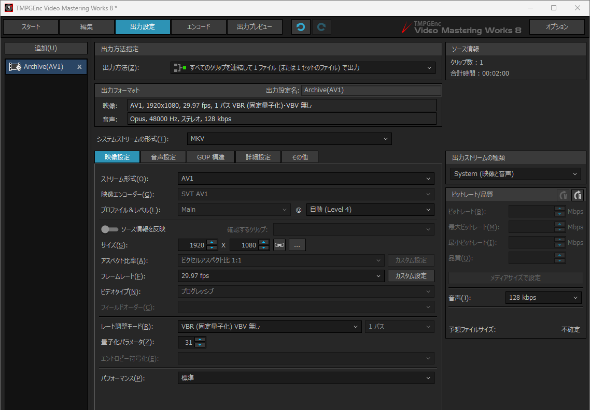
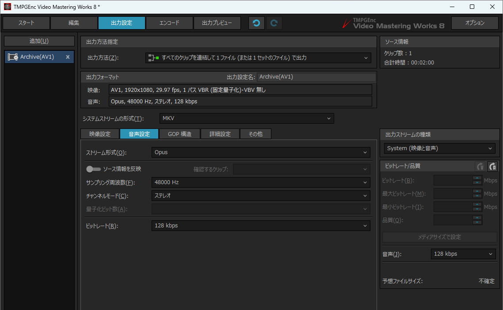
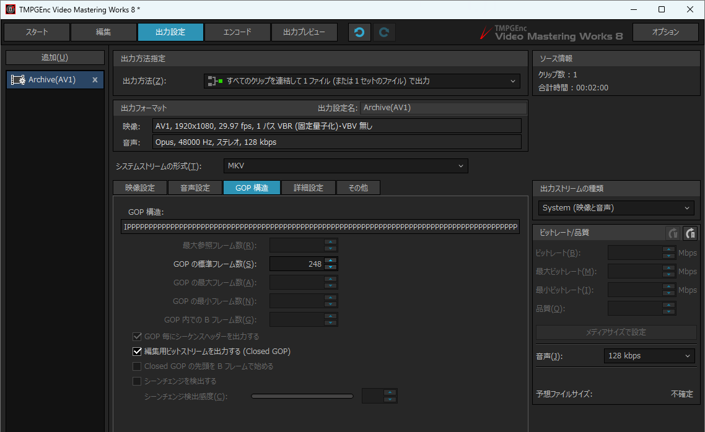
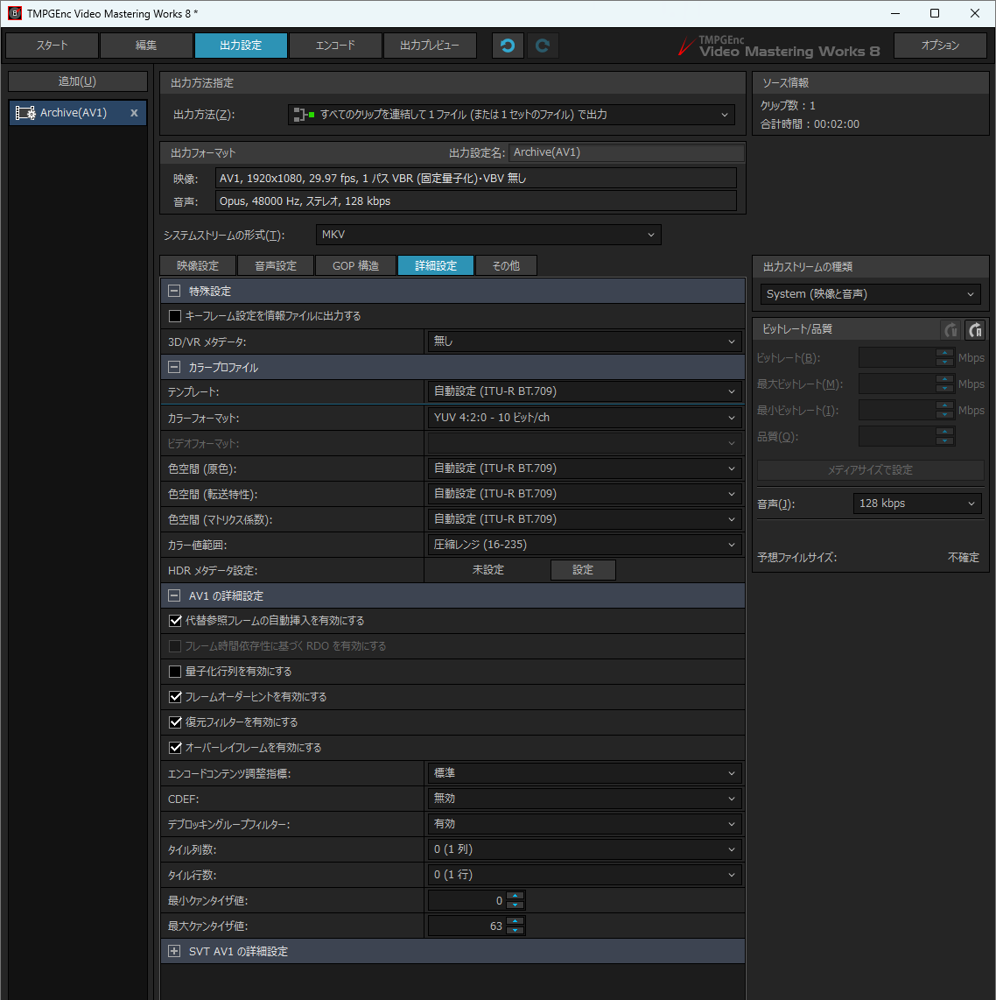
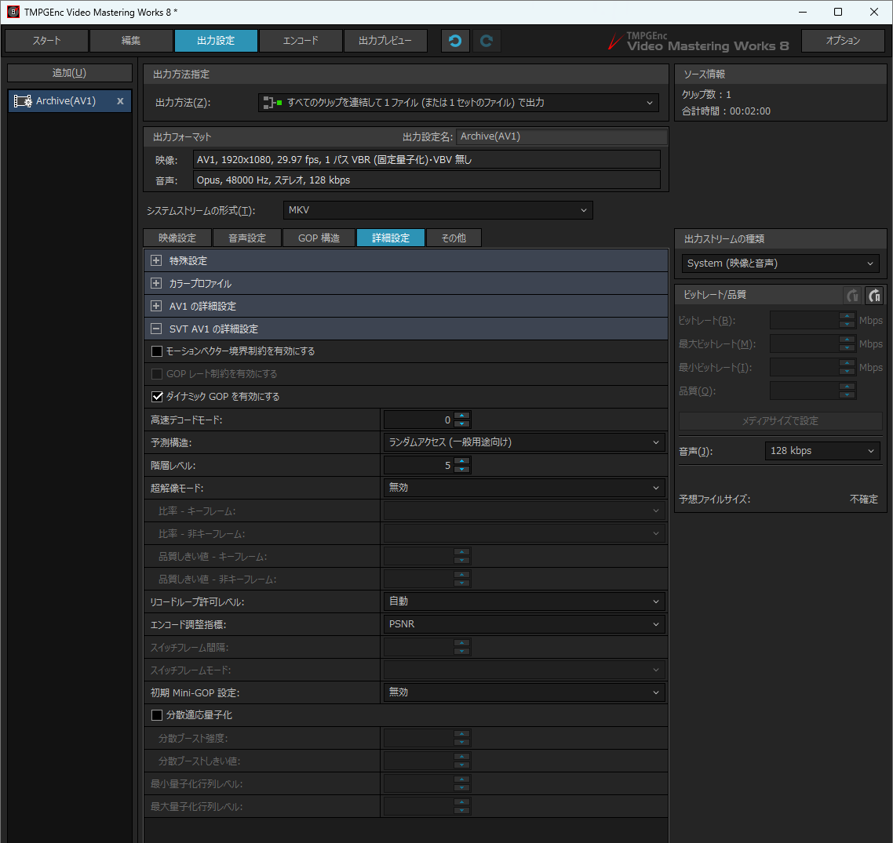
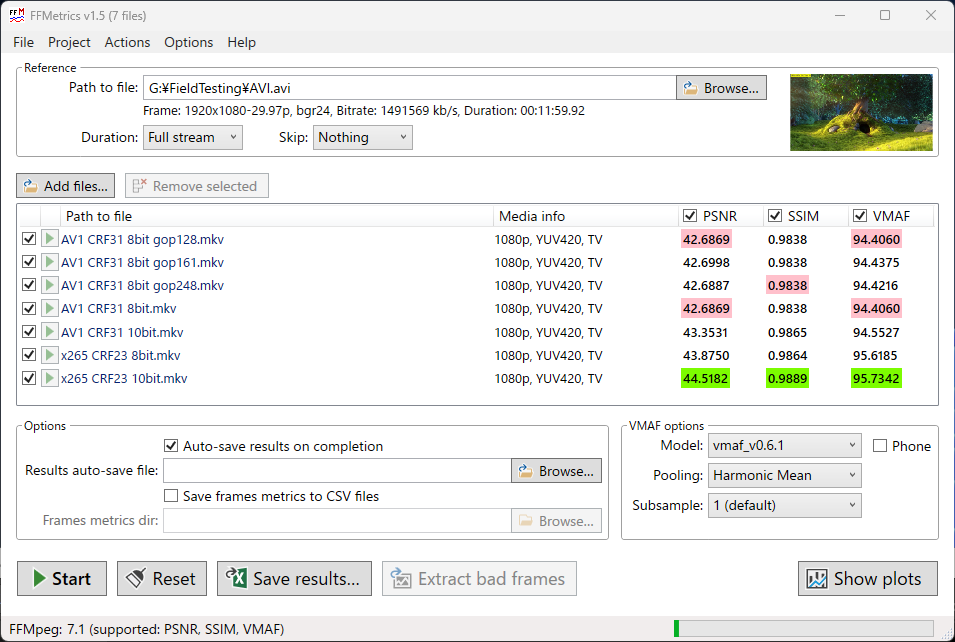

# TMPGEnc Video Mastering Works 8

[TMPGEnc Video Mastering Works 8](https://tmpgenc.pegasys-inc.com/ja/product/tvmw8.html) が発売され、 AV1 に対応したため、こちらでも簡易テストを実施し自分の指標を作成した。

* Version: 8.0.2.3

## 設定

FFmpeg に搭載されていた libsvtav1 を利用しているので CRF 31 でテストしたら良い結果となった。  
そのため FFmpeg の設定に合わせ下記を変更した

|          |                        |                          |
| :------- | :--------------------- | :----------------------- |
| 環境設定 | レート調整モード       | VBR(固定量子化) VBV 無し |
|          | 量子化パラメータ       | 31                       |
|          | パフォーマンス         | 標準                     |
|          |                        |                          |
| 音声設定 | ストリーム形式         | Opus                     |
|          | サンプリング周波数     | 48,000 Hz                |
|          | チャンネルモード       | ステレオ                 |
|          | ビットレート           | 128kbps                  |
|          |                        |                          |
| GOP 構造 | GOP の標準フレーム数   | 248 (av1_qsv に合わせた) |
|          |                        |                          |
| 詳細設定 | **カラープロファイル** |                          |
|          | カラーフォーマット     | YUV 4:2:0 - 10 ビット/ch |

## VMAF 比較

| Name                      | File Size (MB) |
| :------------------------ | -------------: |
| AV1 CRF31 10bit.mkv       |     373.917856 |
| AV1 CRF31 8bit gop128.mkv |     377.641185 |
| AV1 CRF31 8bit gop161.mkv |     373.458931 |
| AV1 CRF31 8bit gop248.mkv |     368.158603 |
| AV1 CRF31 8bit.mkv        |     377.641185 |
| x265 CRF23 10bit.mkv      |     576.435943 |
| x265 CRF23 8bit.mkv       |     585.101646 |
